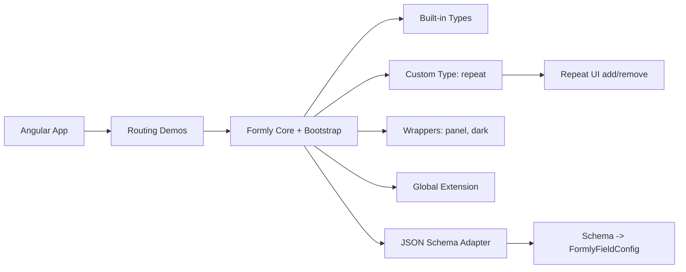

# Advanced Angular Formly Lab

A comprehensive technical guide and sandbox for building dynamic, schema-driven forms in Angular with Formly.

## ES - Descripcion rapida

Este repositorio es un laboratorio practico para aprender y demostrar Formly en escenarios reales:

- Formularios dinamicos basados en configuracion.
- Validaciones de campo y validaciones cruzadas.
- Layout responsive con Bootstrap.
- Secciones repetibles (arrays) mediante custom type.
- Wrappers personalizados y wrappers anidados.
- Integracion con JSON Schema.
- Extensiones globales para mutar campos en tiempo de ejecucion.

Tu descripcion para GitHub esta bien orientada y encaja con el contenido actual del proyecto.

## EN - Quick Description

This repository is a hands-on lab to learn and showcase Formly in practical scenarios:

- Dynamic configuration-driven forms.
- Field-level and cross-field validation.
- Bootstrap responsive layout techniques.
- Repeatable sections (arrays) via custom type.
- Custom and nested wrappers.
- JSON Schema to Formly integration.
- Global extensions that mutate field behavior at runtime.

Your GitHub description is accurate and fits the current implementation.

---

## ES - Que incluye la app

### Rutas de demo

| Ruta                 | Objetivo principal                                                |
| -------------------- | ----------------------------------------------------------------- |
| /form-example        | Campos base, validaciones, mensajes personalizados                |
| /layout-example      | Grid, fieldGroup, className, hideExpression, expressionProperties |
| /reactive-example    | Logica reactiva y validaciones cruzadas                           |
| /date-and-validation | Fechas, rangos y reglas de negocio por horario                    |
| /repeat-section      | Arrays dinamicos con type repeat                                  |
| /json-schema         | Generacion de campos desde JSON Schema                            |
| /custom-elements     | Wrappers panel/dark y composicion visual                          |
| /global-extension    | Demostracion de extension global (prePopulate)                    |

### Arquitectura visual



## EN - What the app contains

### Demo routes

| Route                | Main purpose                                                      |
| -------------------- | ----------------------------------------------------------------- |
| /form-example        | Core fields, validation, custom messages                          |
| /layout-example      | Grid, fieldGroup, className, hideExpression, expressionProperties |
| /reactive-example    | Reactive logic and cross-field validation                         |
| /date-and-validation | Date ranges and business-hour rules                               |
| /repeat-section      | Dynamic arrays with custom repeat type                            |
| /json-schema         | Form generation from JSON Schema                                  |
| /custom-elements     | panel/dark wrappers and nested composition                        |
| /global-extension    | Global prePopulate extension demo                                 |

---

## Stack

- Angular 20
- @ngx-formly/core 7
- @ngx-formly/bootstrap 7
- RxJS 7
- SCSS + Bootstrap
- Jasmine + Karma

## ES - Recomendacion de VS Code

Para mejorar la lectura de los comentarios anotados por color en este laboratorio, se recomienda instalar:

- Better Comments (ID: aaron-bond.better-comments)

Esta extension resalta prefijos como !, ?, TODO o NOTE con distintos colores, haciendo mas clara la documentacion inline del codigo.

## EN - VS Code Recommendation

To improve readability of color-annotated comments in this lab, it is recommended to install:

- Better Comments (ID: aaron-bond.better-comments)

This extension highlights prefixes like !, ?, TODO, or NOTE with different colors, making inline code documentation easier to scan.

## ES - Arranque rapido

```bash
npm install
npm start
```

Abre http://localhost:4200

Comandos utiles:

```bash
npm run build
npm test
```

## EN - Quick Start

```bash
npm install
npm start
```

Open http://localhost:4200

Useful commands:

```bash
npm run build
npm test
```

---

## ES - Puntos tecnicos clave

- Configuracion global de Formly en app.config.ts.
- Registro de type personalizado repeat para arrays dinamicos.
- Registro de wrappers panel y dark para encapsular presentacion.
- Mensajes globales de validacion centralizados.
- Extension global disponible en example-extension.ts (actualmente comentada en app.config.ts).

## EN - Key Technical Points

- Centralized Formly configuration in app.config.ts.
- Custom repeat type registration for dynamic arrays.
- panel and dark wrapper registration for UI composition.
- Global validation messages.
- Global extension available in example-extension.ts (currently commented out in app.config.ts).

---

## Estructura principal

```text
src/app/
	components/
		form-example/
		layout-example/
		reactive-example/
		date-and-validation/
		repeat-section/
		json-schema/
		custom-elements/
		global-extensions/
	shared/
		formly-types/repeat-type/
		formly-wrappers/panel-wrapper.component/
		formly-wrappers/dark-wrapper.component/
		formly-extensions/example-extension.ts
```

## ES - Para quien es este repo

- Equipos que quieran estandarizar formularios dinamicos en Angular.
- Devs que necesiten combinar JSON Schema con UX personalizada.
- Formacion interna sobre Formly avanzado (types, wrappers, extensiones).

## EN - Who this repo is for

- Teams standardizing dynamic forms in Angular.
- Developers combining JSON Schema with custom UX.
- Internal training on advanced Formly patterns (types, wrappers, extensions).
